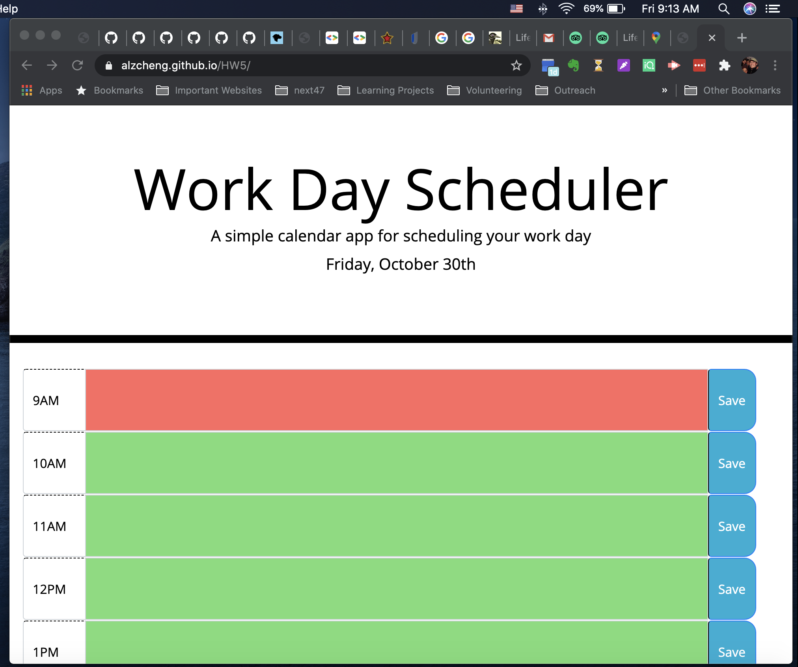

# Work Day Scheduler

## The Application

I created a simple planner application that allows a user to save events for each hour of the day and store the information in the local storage. 

## Screenshot

## Features

This application will have the following features: 

* Initially the planner has the current day displayed at the top.
* Time blocks of the planner are for standard business hours.
* Each time block is color-coded to indicate whether it is in the past (grey), present (red), or future (green) from the current hour.
* The user can click into a time block to enter an event.
* When the Save button is clicked, the text for the event is stored in local storage, so that when the page is refreshed, the saved events persist.

## Learnings 

1. Using JQuery is a lot easier than using vanilla Javascript.
2. Can dynamically change classes in an element.

## Link to finished product website
[Link to finished product](https://alzcheng.github.io/workdayScheduler/)
